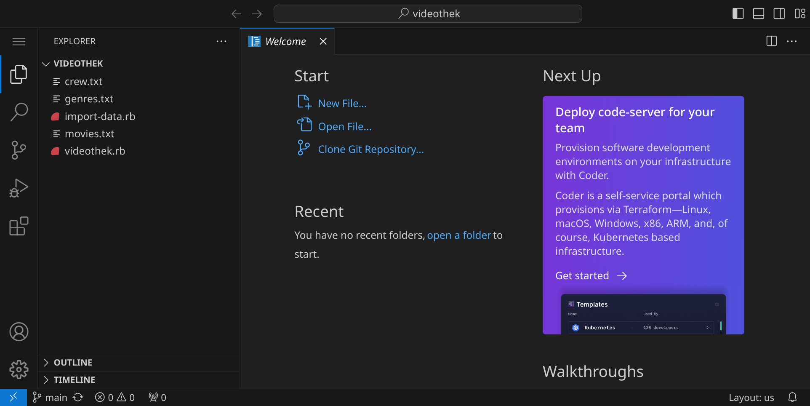

<div class='meta'>
image: erd1.webp:0:50
</div>

# Videothek mit MySQL

<p class='abstract'>
In diesem Kapitel entwickelst du eine Datenbank für eine Videothek, indem du ein Entity-Relationship-Diagramm erstellst und dieses in eine relationale Datenbank überführst. Anschließend lädst du Beispieldaten in die Datenbank und führst erste Abfragen durch. Das Datenmodell wird anschließend Schritt für Schritt erweitert.
</p>

Stelle zuerst sicher, dass du keinen Ordner geöffnet hast. Um sicherzugehen, drücke einfach den Shortcut für »Ordner schließen«: <span class='key'>Strg</span><span class='key'>K</span> und dann <span class='key'>F</span>. Dein Workspace sollte jetzt ungefähr so aussehen:


## Repository klonen

Für diese Anleitung brauchst du ein Repository, das du klonen kannst, indem du auf den blauen Button »Clone Repository« klickst. Gib die folgende URL ein und bestätige mit <span class='key'>Enter</span>:

```bash
https://github.com/specht/videothek.git
```


Als nächstes musst du angeben, in welches Verzeichnis du das Repository klonen möchtest. Bestätige den Standardpfad `/workspace/` mit <span class='key'>Enter</span>.


Beantworte die Frage »Would you like to open the cloned repository?« mit »Open«.


Du siehst nun auf der linken Seite ein paar Dateien, die wir für dieses Projekt verwenden werden:



- die Textdateien enthalten Daten über Filme, Genres und Personen, die wir später in unsere Datenbank importieren werden
- das Ruby-Skript `import-data.rb` wird verwendet, um die Daten in die Datenbank zu importieren
- das Ruby-Skript `videothek.rb` ist unser Hauptprogramm, das wir später verwenden werden, um den Katalog zu durchsuchen, Filme auszuleihen und zurückzugeben

Öffne die Datei `genres.txt` und schau dir die Daten an:


In jeder Zeile siehst du einen Datensatz, der ein Genre beschreibt und im JSON-Format vorliegt. Die Datei `movies.txt` enthält ähnliche Daten, die Filme beschreiben:


Nehmen wir uns einen Datensatz und schauen ihn formatiert an, so erkennen wir eine Struktur:

```json
{
    "id": 2,
    "title": "Nosferatu: A Symphony of Horror",
    "year": 1922,
    "runtime": 94,
    "genres": [
        4,
        5
    ],
    "rating": 7.8,
    "german_title": "Nosferatu, eine Symphonie des Grauens",
    "crew": {
        "actor": [
            8815,
            5049,
            9867,
            8817,
            8805,
            6421,
            2933,
            5028,
            7591,
            5441
        ],
        "director": [
            1549
        ],
        "writer": [
            9305,
            4751
        ],
        "producer": [
            5063
        ],
        "composer": [
            1454,
            4378
        ],
        "cinematographer": [
            2039
        ]
    }
}
```

<div class='hint'>
Die Daten sind in einem Format, das als JSON bekannt ist. JSON steht für »JavaScript Object Notation« und ist ein einfaches Datenformat, das für den Datenaustausch zwischen Anwendungen verwendet wird. Es ist einfach zu lesen und zu schreiben und wird oft in Webanwendungen verwendet.
</div>

## ER-Diagramm zeichnen

Es gibt verschiedene Tools, um ein Entity-Relationship-Diagramm (ERD) zu erstellen. In diesem Tutorial verwenden wir die Erweiterung »ERD Editor« für Visual Studio Code. Um die Erweiterung zu installieren, klicke auf das Erweiterungs-Symbol  in der Seitenleiste oder drücke <span class='key'>Strg</span><span class='key'>Shift</span><span class='key'>X</span>. Suche nach der Erweiterung »ERD Editor« und installiere sie.


Erstelle eine neue Datei mit <span class='key'>Strg</span><span class='key'>Alt</span><span class='key'>N</span> und speichere die Datei unter dem Dateinamen `videothek.erd`, indem du <span class='key'>Strg</span><span class='key'>S</span> drückst, den Namen eingibst und mit <span class='key'>Enter</span> bestätigst.


Die Erweiterung »ERD Editor« erkennt, dass es sich bei der Datei um ein ERD handelt und öffnet den Editor, in dem wir das Diagramm erstellen können.

Erstelle das folgende Diagramm:


- Achte darauf, dass Bezeichner für Tabellen und Attribute keine Leerzeichen und Sonderzeichen enthalten (außer den Unterstrich `_`).
- Achte darauf, dass die Primärschlüssel mit einem gelben Schlüsselsymbol markiert sind.
- Die Fremdschlüssel in der Tabelle `movie_genre` entstehen automatisch, wenn du die Beziehung zwischen den Tabellen `movie` und `genre` herstellst (Fremdschlüssel sind pink markiert).
- Achtung: Da beide ursprünglichen Primärschlüssel `id` heißen, musst du sie in `movie_id` und `genre_id` umbenennen, damit es keine Verwechslungen gibt.
- Markiere die beiden Fremdschlüssel in der Tabelle `movie_genre` zusätzlich als Primärschlüssel, sie sollten dann blau dargestellt werden.
- Der Eintrag `N-N` steht für »NOT NULL« und bedeutet, dass der Wert nicht leer sein darf.

## Datenbankstruktur erstellen

Wenn du fertig bist, kannst du das Diagramm speichern und den SQL-Code exportieren, den wir später verwenden werden, um die Datenbankstruktur zu erstellen. Klicke dazu mit rechts auf den Hintergrund und wähle »Export« / »Schema SQL«.


Wähle als Dateinamen `videothek.sql` und bestätige mit <span class='key'>Enter</span>:


Schau dir die Datei `videothek.sql` an, die den SQL-Code für die Datenbankstruktur enthält:

_include_file(videothek.sql, sql)

Diese SQL-Statements sorgen dafür, dass die Tabellen `movie`, `genre` und `movie_genre` mit den entsprechenden Attributen und Primärschlüsseln erstellt werden. Zusätzlich werden die Fremdschlüsselbeziehungen zwischen den Tabellen definiert.

Um den Code auszuführen, geben wir die Befehle an `mycli`. Öffne dazu ein Terminal und gib folgenden Befehl ein:

```bash
mycli < videothek.sql
```


<div class='hint'>
Falls du eine Fehlermeldung bekommen solltest, dass die Tabellen schon existieren, kannst du deine MySQL-Datenbank im Profil zurücksetzen. Sei aber vorsichtig und schau genau hin, damit du nicht aus Versehen deinen kompletten Workspace zurücksetzt.
</div>

Du kannst nun mit `mycli` überprüfen, ob die Tabellen korrekt erstellt wurden:

```bash
mycli
```


Solange du in `mycli` bist, kannst du SQL-Befehle eingeben. Um die Tabellen anzuzeigen, gib folgenden Befehl ein:


```sql
SHOW TABLES;
```


Du siehst, dass die Tabellen existieren, allerdings sind sie noch leer:


## Daten importieren

Um die Tabellen mit Daten zu füllen, verwenden wir das Ruby-Skript `import-data.rb`. Dieses Skript liest die Textdateien `movies.txt` und `genres.txt` und fügt die Daten in die Datenbank ein.

Bevor wir das Skript ausführen können, müssen wir noch das Rubygem `mysql2` installieren. Öffne dazu ein Terminal und gib folgenden Befehl ein:

```bash
gem install mysql2
```

Wenn alles korrekt funktioniert, sollte deine Ausgabe in etwa so aussehen:


Führe anschließend das Skript `import-data.rb` im Terminal aus:

```bash
ruby import-data.rb
```

<div class='hint'>
Falls du eine Fehlermeldung bekommst, in der von einem SQL-Syntaxfehler die Rede ist, befindest du vermutlich noch in <code>mycli</code>. Beende das Programm mit dem Befehl <code>exit</code> (oder drücke einfach <span class='key'>Strg</span><span class='key'>D</span>) und gib den Befehl im Terminal erneut ein.
</div>

Du solltest sehen, wie die Genres und Filme nach und nach importiert werden:


Du kannst nun in `mycli` überprüfen, ob die Daten korrekt importiert wurden:

```sql
SELECT title, year
FROM movie JOIN movie_genre JOIN genre
ON movie.id = movie_genre.movie_id AND movie_genre.genre_id = genre.id
WHERE genre.name = "Animation";
```


## Videothek starten

Bevor wir das Hauptprogramm `videothek.rb` starten können, müssen wir noch das Rubygem `tty` installieren (es handelt sich dabei um eine Familie von Rubygems, die es ermöglichen, interaktive Konsolenanwendungen zu erstellen). Öffne dazu ein Terminal und gib folgenden Befehl ein:

```bash
gem install tty
```
Die Installation dauert ein paar Sekunden, und wenn sie erfolgreich abgeschlossen ist, siehst du eine Ausgabe wie diese:


Führe anschließend das Skript `videothek.rb` im Terminal aus:

```bash
ruby videothek.rb
```


Du kannst nun die Pfeiltasten <span class='key'>↑</span> und <span class='key'>↓</span>, die Eingabetaste <span class='key'>Enter</span> und die Escape-Taste <span class='key'>Esc</span> verwenden, um durch die Menüs zu navigieren.

<div class='hint'>
Verwende die <span class='key'>Bild↑</span> und <span class='key'>Bild↓</span>-Tasten, um schneller durch die Menüs zu navigieren.
</div>

Wähle »Genres durchstöbern« und dann »Animation«, um eine Liste der Animationsfilme anzuzeigen:


An dieser Stelle wird das Programm mit einer Fehlermeldung beendet, da der entsprechende Teil noch nicht implementiert ist:


Scrolle ggfs. nach oben, bis du den Anfang der Fehlermeldung siehst. Die komplette Fehlermeldung siehst du hier:

```text
/workspace/.gem/gems/mysql2-0.5.6/lib/mysql2/client.rb:151:in `_query': Query was empty (Mysql2::Error)
        from /workspace/.gem/gems/mysql2-0.5.6/lib/mysql2/client.rb:151:in `block in query'
        from /workspace/.gem/gems/mysql2-0.5.6/lib/mysql2/client.rb:150:in `handle_interrupt'
        from /workspace/.gem/gems/mysql2-0.5.6/lib/mysql2/client.rb:150:in `query'
        from videothek.rb:22:in `block (3 levels) in choose_with_query'
        from /workspace/.gem/gems/tty-prompt-0.21.0/lib/tty/prompt/list.rb:221:in `call'
        from /workspace/.gem/gems/tty-prompt-0.21.0/lib/tty/prompt.rb:242:in `invoke_select'
        from /workspace/.gem/gems/tty-prompt-0.21.0/lib/tty/prompt.rb:279:in `select'
        from videothek.rb:20:in `block (2 levels) in choose_with_query'
        from videothek.rb:19:in `catch'
        from videothek.rb:19:in `block in choose_with_query'
        from videothek.rb:17:in `loop'
        from videothek.rb:17:in `choose_with_query'
        from videothek.rb:52:in `browse_movies_by_genre'
        from videothek.rb:31:in `block in choose_with_query'
        from videothek.rb:17:in `loop'
        from videothek.rb:17:in `choose_with_query'
        from videothek.rb:71:in `block in <main>'
        from videothek.rb:59:in `loop'
        from videothek.rb:59:in `<main>'
```

Die erste Zeile gibt dir einen Hinweis darauf, was überhaupt passiert ist. »Query was empty« bedeutet, dass eine leere Anfrage an die Datenbank gesendet wurde. In der Datei `videothek.rb` findest du die fehlerhafte Stelle in Zeile 51:


## Datenbankabfrage implementieren

Wir werden nun die entsprechende Abfrage formulieren und in den Quelltext einfügen. Wir bekommen eine `genre_id` als Parameter übergeben und sollen nun alle Filme aus der Datenbank herausfiltern, die zu diesem Genre gehören.

Um die Abfrage zu entwickeln, können wir wieder `mycli` verwenden. Wir wollen alle Filme ausgeben, die zu einem bestimmten Genre gehören, dessen ID wir kennen. Dazu müssen wir die Tabellen `movie` und `movie_genre` mit Hilfe einer `JOIN`-Klausel verknüpfen.

Zu jedem `JOIN` gehört ein `ON`-Statement, das definiert, welche Einträge aus jeder der beteiligten Tabellen zusammengeführt werden sollen. In unserem Fall verknüpfen wir die Tabellen `movie` und `movie_genre` über die Spalte `id` und `movie_id`:

```sql
SELECT *
FROM movie JOIN movie_genre
ON movie.id = movie_genre.movie_id;
```

<div class='hint'>
Die <code>ON</code>-Klausel ist ein wichtiger Bestandteil von <code>JOIN</code>-Anweisungen. Wenn du sie vergisst, wird die Datenbank alle möglichen Kombinationen der Einträge aller beteiligten Tabellen zurückgeben, was zu einem sehr großen Ergebnis – in unserem Fall 16,7 Millionen Einträgen – führen kann. Du wirst merken, dass die Abfrage sehr lange dauert, du kannst die Ausführung mit <span class='key'>Strg</span><span class='key'>C</span> abbrechen.
</div>

Wir bekommen nun eine relativ große Tabelle, in der alle Filme mit ihren Genres aufgelistet sind. Ingesamt sind es über 6700 Einträge, obwohl es in unserer Datenbank nur ca. 2500 Filme gibt. Das liegt daran, dass jeder Film mehrere Genres haben kann und deshalb mehrfach durch die gestellte Abfrage zurückgegeben wird.


Da wir uns nur für die Spalten `id`, `titel` und `year` interessieren, können wir die Abfrage entsprechend anpassen. Zusätzlich zur ID des Films interessiert uns auch die ID des Genres, um später die Filme nach Genres filtern zu können:

```sql
SELECT id, genre_id, title, year
FROM movie JOIN movie_genre
ON movie.id = movie_genre.movie_id;
```

Wir erhalten nun eine Tabelle mit weniger Spalten (jedoch genauso vielen Zeilen):


Um die Abfrage weiter einzuschränken, werden wir die `WHERE`-Klausel verwenden, um nur die Filme auszugeben, die zum Genre »Animation« gehören (dieses Genre hat in unserer Datenbank die ID 13):

```sql
SELECT id, genre_id, title, year
FROM movie JOIN movie_genre
ON movie.id = movie_genre.movie_id
WHERE genre_id = 13;
```

Wir erhalten nun eine Auflistung von Animationsfilmen:


Da die Filme nach Titel und Jahr sortiert zurückgegeben werden sollen, fügen wir eine `ORDER BY`-Klausel hinzu:

```sql
SELECT id, title, year
FROM movie JOIN movie_genre
ON movie.id = movie_genre.movie_id
WHERE genre_id = 13
ORDER BY title, year;
```

<div class='hint'>
Da uns die Genre-ID nur für die Auswahl der Filme benötigt wurde und uns nicht weiter interessiert, können wir sie aus der Abfrage entfernen.
</div>


Unsere Abfrage ist nun also fertig und wir können sie in unser Ruby-Programm einfügen. Öffne dazu die Datei `videothek.rb` und ändere den Code in Zeile 51 wie folgt:


- Die gewünschte Genre-ID wird als Parameter `genre_id` in Z. 47 übergeben und in Z. 55 mit Hilfe von String Interpolation (zwischen `#{` und `}`) in die Abfrage eingefügt.
- Um das SQL-Statement besser lesbar zu machen, wird es auf mehrere Zeilen aufgeteilt (Z. 51 bis 57). Dazu wird der Beginn eines mehrzeiligen Strings mit `<<~SQL` markiert und mit `SQL` beendet (anstelle von `SQL` könnten wir auch jeden anderen Bezeichner wählen).
- Der Rest des Programms bleibt unverändert.

Führe das Programm erneut aus:

```bash
ruby videothek.rb
```

Unsere Codeänderung hat funktioniert und wir können nun die Animationsfilme durchstöbern:


Wählen wir einen Film, so bekommen wir weitere Informationen angezeigt:


## Videothek erweitern

Versuche, die Videothek zu erweitern, indem du weitere Funktionen hinzufügst:

- die 100 besten Filme durchstöbern
- Filmanzeige erweitern: Genres anzeigen
- die 50 besten Filme pro Jahrzehnt durchstöbern
- Film nach Titel suchen

### Datenmodell erweitern

Wenn du diese Funktionen implementiert hast, kannst du dein Datenmodell um an den Filmen beteiligte Personen erweitern. Dazu musst du die Tabellen `crew`, `movie_crew` und `job` hinzufügen und die Beziehungen zwischen den Tabellen definieren:


<div class='hint'>
In der Tabelle <code>movie_crew</code> werden diesmal drei Tabellen miteinander verbunden. Alle drei Fremdschlüssel sind gleichzeitig Primärschlüssel, da sie zusammen eindeutig sind, weil eine Person in einem Film mehrere Jobs haben kann.
</div>

Erweitere außerdem bei der Gelegenheit gleich die Tabelle `movie` um die Spalte `german_title`. Exportiere das SQL-Schema erneut als `videothek.sql`, setze deine Datenbank zurück und gib die Datei an `mycli`:

```bash
mycli < videothek.sql
```

Ersetze anschließend den Code in `import-data.rb` durch folgenden Code:

_include_file(import-data.rb, ruby)

Führe das Skript aus – es wird diesmal etwas länger dauern, da mehr Daten importiert werden.

Versuche nun, die folgenden Funktionen zu implementieren:

- Filmsuche erweitern: »eine neue hoffnung« soll genauso ein Ergebnis liefern wie »a new hope«
- Filmanzeige erweitern: Crew anzeigen
- nach Personen suchen
- alle Filme anzeigen, an denen einen Person beteiligt war (wie die Filmanzeige, nur für Personen)
- die wichtigsten 100 Regisseur:innen / Schauspieler:innen pro Jahrzehnt anzeigen

### Nutzer und Ausleihen implementieren

Bis hierhin ist die Videothek "nur" eine Filmdatenbank. Um sie zu einer Videothek zu machen, fehlen noch die Nutzer und die Möglichkeit, Filme auszuleihen. Erweitere das Datenmodell um die entsprechenden Tabellen und füge die fehlende Funktionalität hinzu.

## Zusammenfassung

In diesem Kapitel hast du eine Datenbank für eine Videothek entwickelt, indem du ein Entity-Relationship-Diagramm erstellt und dieses in eine relationale Datenbank überführt hast. Anschließend hast du Beispieldaten in die Datenbank geladen und erste Abfragen durchgeführt. Das Datenmodell wurde Schritt für Schritt erweitert, um die Videothek um weitere Funktionen zu erweitern.