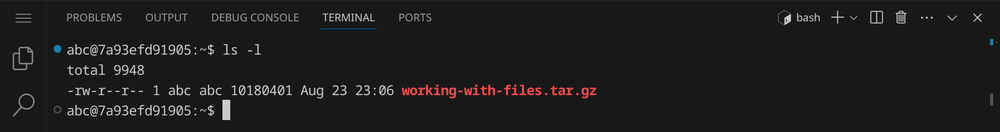
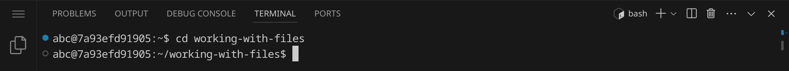

# Dateien und Verzeichnisse

<p class='abstract'>
In diesem Kapitel lernst du, wie du mit Dateien und Verzeichnissen in der Kommandozeile arbeiten kannst. Wir werden einige der wichtigsten Befehle kennenlernen, die wir verwenden können, um Dateien und Verzeichnisse zu erstellen, zu löschen, zu kopieren, zu verschieben und zu bearbeiten. Wir werden auch lernen, wie wir den Inhalt von Dateien anzeigen und analysieren können.
</p>

Stelle zuerst sicher, dass du keinen Ordner geöffnet hast. Um sicherzugehen, drücke einfach den Shortcut für »Ordner schließen«: <span class='key'>Strg</span><span class='key'>K</span> und dann <span class='key'>F</span>. Dein Workspace sollte jetzt ungefähr so aussehen:


Öffne als nächstes das Terminal, indem du den Shortcut <span class='key'>Strg</span><span class='key'>J</span> drückst. Dein Workspace sollte jetzt ungefähr so aussehen:


Du kannst das Terminal auch maximieren, indem du auf den Pfeil in der rechten oberen Ecke des Terminals klickst. Die linke Seitenleiste kannst du mit <span class='key'>Strg</span><span class='key'>B</span> ein- und ausblenden.

Im Terminal siehst du nun einen Prompt, der dir anzeigt, in welchem Verzeichnis du dich befindest. Der Prompt sieht in etwa so aus:

```bash
abc@fefd40576dad:~$
```

Lass dich von dem Prompt nicht verwirren. Der Teil `abc` vor dem `@` ist dein Benutzername, der Teil `fefd40576dad` nach dem `@` ist der Name deines Computers, und der Teil nach dem `:` ist das aktuelle Verzeichnis. In diesem Fall ist das aktuelle Verzeichnis `~`, was das Home-Verzeichnis deines Benutzers ist. Das `$` am Ende des Prompts zeigt an, dass du als normaler Benutzer angemeldet bist. Wenn du als Administrator angemeldet wärst, würde das `$` durch ein `#` ersetzt.

Gib folgenden Befehl ein und drücke die Eingabetaste:

```bash
echo "Hello, World!"
```
Wenn du die Ausgabe `Hello, World!` siehst, hast du alles richtig gemacht. Herzlichen Glückwunsch!


Jetzt können wir anfangen, mit Dateien und Verzeichnissen zu arbeiten.

## Beispieldateien herunterladen

Gib folgenden Befehl ein, um eine Datei herunterzuladen, die ein paar Beispieldateien enthält:

```bash
wget #{WEB_ROOT}/dl/working-with-files.tar.gz
```
Die Ausgabe sollte in etwa so aussehen:


Das Programm `wget` können wir dazu verwenden, um Dateien aus dem Internet herunterzuladen.
Die Datei wird standardmäßig im aktuellen Verzeichnis gespeichert. Schau nach, ob die Datei
angekommen ist, indem du den Befehl `ls` eingibst:


Für mehr Details verwende den Befehlt `ls -l` (für »long«):



Du siehst nun, wie groß die Datei ist. Nutze den Befehl `ls -lh` (für »long human-readable«),
um die Größe in einer besser lesbaren Form zu sehen:


Die Datei ist also fast 10 MB groß. Die Endung `.tar.gz` zeigt an, dass es sich um ein
komprimiertes Archiv handelt. Wir können es mit dem Befehl `tar` entpacken:

```bash
tar xvf working-with-files.tar.gz
```

Die Optionen `xvf` stehen für `extract`, `verbose` und `file`. Das bedeutet, dass wir das
Archiv entpacken (`x` für »extract«), den Fortschritt anzeigen (`v` für »verbose«) und als
nächste Option den Dateinamen angeben (`f` für »file«). Wenn du den Befehl
ausführst, solltest du eine Meldung sehen, die dir anzeigt, welche Dateien entpackt wurden:


Gib noch einmal `ls -l` ein, um zu sehen, was sich nun in deinem Verzeichnis befindet:


Du solltest jetzt zusätzlich zur heruntergelandenen Archivdatei ein Verzeichnis namens
`working-with-files` sehen. Du erkennst an dem `d` am Anfang der Zeile, dass es sich um ein
Verzeichnis handelt.

<div class='hint'>
Um dein Terminal aufzuräumen, kannst du den Befehl <code>clear</code> verwenden oder einfach die Tastenkombination <span class='key'>Strg</span><span class='key'>L</span> drücken.
</div>

## Überblick verschaffen

<div class='hint'>
In diesem Abschnitt lernst du die Befehle <code>pwd</code>, <code>cd</code>, <code>ls</code> und <code>file</code> kennen.
</div>

Gib den Befehl `pwd` ein und drücke die Eingabetaste:


Der Befehl `pwd` steht für »print working directory« und zeigt dir das aktuelle Verzeichnis an, in dem du dich gerade befindest. Das aktuelle Verzeichnis wird auch im Prompt angezeigt – da im Workspace das Verzeichnis `/workspace` dein Home-Verzeichnis ist, wird es im Prompt mit `~` abgekürzt.

Wechsle nun in das entpackte Verzeichnis, indem du `cd working-with-files` eingibst und die Eingabetaste drückst. Du solltest nun im Verzeichnis `working-with-files` sein, was du leicht am Prompt erkennen kannst.



Wechsle wieder in das übergeordnete Verzeichnis, indem du `cd ..` eingibst und die Eingabetaste drückst. Du solltest nun wieder im Home-Verzeichnis sein.


### Die Tab-Ergänzung verwenden

Ein nützliches Feature der Kommandozeile ist die Tab-Ergänzung. Wenn du anfängst, einen Befehl oder einen Dateinamen einzugeben, kannst du die Tab-Taste drücken, um den Befehl oder den Dateinamen automatisch zu vervollständigen. Wenn es mehrere Möglichkeiten gibt, kannst du die Tab-Taste zweimal drücken, um eine Liste der verfügbaren Optionen zu sehen.

Wechsle wieder in das Verzeichnis, aber gib diesmal nur `cd w` ein und drücke die Tab-Taste. Die Kommandozeile vervollständigt den Befehl automatisch, weil es nur eine mögliche Option für einen Verzeichniswechsel gibt, die mit `w` beginnt.

Lass dir anschließend die Inhalte des Verzeichnisses mit `ls -l` anzeigen:


<div class='hint'>
Es gibt noch eine versteckte Datei in diesem Verzeichnis, die du dir mit dem Befehl <code>ls -la</code> (für »long all«) anzeigen lassen kannst. Versteckte Dateien beginnen unter Linux mit einem Punkt.
</div>

Gib nun den Befehl `file *` ein und drücke die Eingabetaste. Der Stern `*` ist ein Platzhalter, der für alle Dateien im aktuellen Verzeichnis steht. Der Befehl `file` zeigt den Dateityp einer Datei an und mit `file *` können wir also den Dateityp aller Dateien im aktuellen Verzeichnis anzeigen.


Oft ist der Dateityp einer Datei schon anhand der Dateiendung zu erkennen. Das Programm `file` kann jedoch auch den Dateityp von Dateien ohne Dateiendung bestimmen und gibt einige zusätzliche Informationen aus.

Wir sehen die folgenden Dateien:

<table class='table table-sm'>
<tr><td><code>alice.txt</code></td><td>eine normale Textdatei</td></tr>
<tr><td><code>jay.webm</code></td><td>eine Videodatei im WebM-Format</td></tr>
<tr><td><code>music-releases.tar.bz2</code></td><td>ein komprimiertes Archiv im Bzip2-Format</td></tr>
<tr><td><code>stallman.jpg</code></td><td>eine Bilddatei im JPEG-Format mit sehr vielen Metadaten</td></tr>
<tr><td><code>zork.zip</code></td><td>ein komprimiertes Archiv im ZIP-Format</td></tr>
</td>
</tr>
</table>

In den folgenden Abschnitten wirst du weitere Befehle kennenlernen und anhand dieser Dateien ausprobieren können.

## Dateien anzeigen

<div class='hint'>
In diesem Abschnitt lernst du die Befehle <code>cat</code>, <code>less</code> und <code>hd</code> kennen.
</div>

## Dateien erstellen und bearbeiten

<div class='hint'>
In diesem Abschnitt lernst du die Befehle <code>touch</code>, <code>nano</code>, <code>vim</code> und <code>emacs</code> kennen.
</div>

## Dateien analysieren, durchsuchen und filtern

<div class='hint'>
In diesem Abschnitt lernst du die Befehle <code>wc</code>, <code>grep</code>, <code>sort</code>, <code>uniq</code>, <code>head</code>, <code>tail</code>, <code>diff</code> und <code>sha1sum</code> kennen.
</div>

## Verzeichnisse analysieren und durchsuchen

<div class='hint'>
In diesem Abschnitt lernst du die Befehle <code>du</code> und <code>find</code> kennen.
</div>

## Dateien (und Verzeichnisse) kopieren, verschieben und löschen

<div class='hint'>
In diesem Abschnitt lernst du die Befehle <code>rm</code>, <code>cp</code>, <code>mv</code>, <code>mkdir</code> und <code>rmdir</code> kennen.
</div>

## Dateien archivieren und extrahieren

<div class='hint'>
In diesem Abschnitt lernst du die Befehle <code>tar</code>, <code>tree</code>, <code>gzip</code>, <code>bzip2</code>, <code>zip</code> und <code>unzip</code> kennen.
</div>

## Dateien aus dem Internet herunterladen

<div class='hint'>
In diesem Abschnitt lernst du die Befehle <code>wget</code> und <code>curl</code> kennen.
</div>
