# Dateien und Verzeichnisse

<p class='abstract'>
In diesem Kapitel lernst du, wie du mit Dateien und Verzeichnissen in der Kommandozeile arbeiten kannst. Wir werden einige der wichtigsten Befehle kennenlernen, die wir verwenden können, um Dateien und Verzeichnisse zu erstellen, zu löschen, zu kopieren, zu verschieben und zu bearbeiten. Wir werden auch lernen, wie wir den Inhalt von Dateien anzeigen und analysieren können.
</p>

Stelle zuerst sicher, dass du keinen Ordner geöffnet hast. Um sicherzugehen, drücke einfach den Shortcut für »Ordner schließen«: <span class='key'>Strg</span><span class='key'>K</span> und dann <span class='key'>F</span>. Dein Workspace sollte jetzt ungefähr so aussehen:


Öffne als nächstes das Terminal, indem du den Shortcut <span class='key'>Strg</span><span class='key'>J</span> drückst. Dein Workspace sollte jetzt ungefähr so aussehen:


Du kannst das Terminal auch maximieren, indem du auf den Pfeil in der rechten oberen Ecke des Terminals klickst. Die linke Seitenleiste kannst du mit <span class='key'>Strg</span><span class='key'>B</span> ein- und ausblenden.

Im Terminal siehst du nun einen Prompt, der dir anzeigt, in welchem Verzeichnis du dich befindest. Der Prompt sieht in etwa so aus:

```bash
abc@fefd40576dad:~$
```

Lass dich von dem Prompt nicht verwirren. Der Teil `abc` vor dem `@` ist dein Benutzername, der Teil `fefd40576dad` nach dem `@` ist der Name deines Computers, und der Teil nach dem `:` ist das aktuelle Verzeichnis. In diesem Fall ist das aktuelle Verzeichnis `~`, was das Home-Verzeichnis deines Benutzers ist. Das `$` am Ende des Prompts zeigt an, dass du als normaler Benutzer angemeldet bist. Wenn du als Administrator angemeldet wärst, würde das `$` durch ein `#` ersetzt.

Gib folgenden Befehl ein und drücke die Eingabetaste:

```bash
echo "Hello, World!"
```
Wenn du die Ausgabe `Hello, World!` siehst, hast du alles richtig gemacht. Herzlichen Glückwunsch!


Jetzt können wir anfangen, mit Dateien und Verzeichnissen zu arbeiten.

## Beispieldateien herunterladen

Gib folgenden Befehl ein, um eine Datei herunterzuladen, die ein paar Beispieldateien enthält:

```bash
wget #{WEB_ROOT}/dl/working-with-files.tar.gz
```
Die Ausgabe sollte in etwa so aussehen:


Das Programm `wget` können wir dazu verwenden, um Dateien aus dem Internet herunterzuladen.
Die Datei wird standardmäßig im aktuellen Verzeichnis gespeichert. Schau nach, ob die Datei
angekommen ist, indem du den Befehl `ls` eingibst:

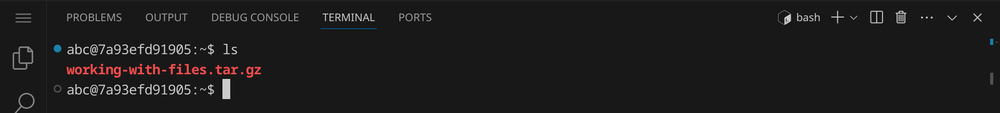

Für mehr Details verwende den Befehlt `ls -l` (für »long«):


Du siehst nun, wie groß die Datei ist. Nutze den Befehl `ls -lh` (für »long human-readable«),
um die Größe in einer besser lesbaren Form zu sehen:

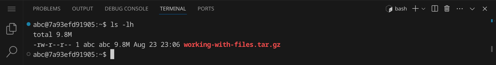

Die Datei ist also fast 10 MB groß. Die Endung `.tar.gz` zeigt an, dass es sich um ein
komprimiertes Archiv handelt. Wir können es mit dem Befehl `tar` entpacken:

```bash
tar xvf working-with-files.tar.gz
```

Die Optionen `xvf` stehen für `extract`, `verbose` und `file`. Das bedeutet, dass wir das
Archiv entpacken (`x` für »extract«), den Fortschritt anzeigen (`v` für »verbose«) und als
nächste Option den Dateinamen angeben (`f` für »file«). Wenn du den Befehl
ausführst, solltest du eine Meldung sehen, die dir anzeigt, welche Dateien entpackt wurden:

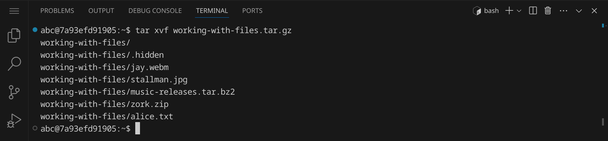

Gib noch einmal `ls -l` ein, um zu sehen, was sich nun in deinem Verzeichnis befindet:


Du solltest jetzt zusätzlich zur heruntergelandenen Archivdatei ein Verzeichnis namens
`working-with-files` sehen. Du erkennst an dem `d` am Anfang der Zeile, dass es sich um ein
Verzeichnis handelt.

<div class='hint'>
Um dein Terminal aufzuräumen, kannst du den Befehl <code>clear</code> verwenden oder einfach die Tastenkombination <span class='key'>Strg</span><span class='key'>L</span> drücken.
</div>

## Überblick verschaffen

<div class='hint books'>
In diesem Abschnitt lernst du die Befehle <code>pwd</code>, <code>cd</code>, <code>ls</code> und <code>file</code> kennen.
</div>

Gib den Befehl `pwd` ein und drücke die Eingabetaste:

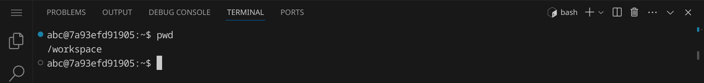

Der Befehl `pwd` steht für »print working directory« und zeigt dir das aktuelle Verzeichnis an, in dem du dich gerade befindest. Das aktuelle Verzeichnis wird auch im Prompt angezeigt – da im Workspace das Verzeichnis `/workspace` dein Home-Verzeichnis ist, wird es im Prompt mit `~` abgekürzt.

Wechsle nun in das entpackte Verzeichnis, indem du `cd working-with-files` eingibst und die Eingabetaste drückst. Du solltest nun im Verzeichnis `working-with-files` sein, was du leicht am Prompt erkennen kannst.


Wechsle wieder in das übergeordnete Verzeichnis, indem du `cd ..` eingibst und die Eingabetaste drückst. Du solltest nun wieder im Home-Verzeichnis sein.

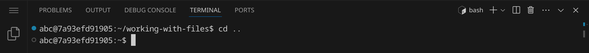

### Die Tab-Ergänzung verwenden

Ein nützliches Feature der Kommandozeile ist die Tab-Ergänzung. Wenn du anfängst, einen Befehl oder einen Dateinamen einzugeben, kannst du die Tab-Taste drücken, um den Befehl oder den Dateinamen automatisch zu vervollständigen. Wenn es mehrere Möglichkeiten gibt, kannst du die Tab-Taste zweimal drücken, um eine Liste der verfügbaren Optionen zu sehen.

Wechsle wieder in das Verzeichnis, aber gib diesmal nur `cd w` ein und drücke die Tab-Taste. Die Kommandozeile vervollständigt den Befehl automatisch, weil es nur eine mögliche Option für einen Verzeichniswechsel gibt, die mit `w` beginnt.

Lass dir anschließend die Inhalte des Verzeichnisses mit `ls -l` anzeigen:


<div class='hint'>
Es gibt noch eine versteckte Datei in diesem Verzeichnis, die du dir mit dem Befehl <code>ls -la</code> (für »long all«) anzeigen lassen kannst. Versteckte Dateien beginnen unter Linux mit einem Punkt.
</div>

Gib nun den Befehl `file *` ein und drücke die Eingabetaste. Der Stern `*` ist ein Platzhalter, der für alle Dateien im aktuellen Verzeichnis steht. Der Befehl `file` zeigt den Dateityp einer Datei an und mit `file *` können wir also den Dateityp aller Dateien im aktuellen Verzeichnis anzeigen.


Oft ist der Dateityp einer Datei schon anhand der Dateiendung zu erkennen. Das Programm `file` kann jedoch auch den Dateityp von Dateien ohne Dateiendung bestimmen und gibt einige zusätzliche Informationen aus.

Wir sehen die folgenden Dateien:

<table class='table table-sm'>
<tr><td><code>alice.txt</code></td><td>eine normale Textdatei</td></tr>
<tr><td><code>jay.webm</code></td><td>eine Videodatei im WebM-Format</td></tr>
<tr><td><code>music-releases.tar.bz2</code></td><td>ein komprimiertes Archiv im Bzip2-Format</td></tr>
<tr><td><code>stallman.jpg</code></td><td>eine Bilddatei im JPEG-Format mit sehr vielen Metadaten</td></tr>
<tr><td><code>zork.zip</code></td><td>ein komprimiertes Archiv im ZIP-Format</td></tr>
</td>
</tr>
</table>

In den folgenden Abschnitten wirst du weitere Befehle kennenlernen und anhand dieser Dateien ausprobieren können.

## Dateien anzeigen

<div class='hint books'>
In diesem Abschnitt lernst du die Befehle <code>cat</code>, <code>less</code> und <code>hd</code> kennen.
</div>

Gib `cat alice.txt` ein und drücke die Eingabetaste. Der Befehl `cat` steht für »concatenate« und zeigt den Inhalt einer Datei an. Die Datei `alice.txt` enthält den Text des Buches »Alice im Wunderland« von Lewis Carroll. Der Text stammt von [Project Gutenberg](https://www.gutenberg.org/) und da der ganze Text im Terminal an dir vorbei rauscht, siehst du auch nur die letzten Zeilen, die auf die Quelle des Textes hinweisen:


Um den Text Seite für Seite zu lesen und die Möglichkeit zum scrollen zu bekommen, kannst du den Befehl `less` verwenden. Gib `less alice.txt` ein und drücke die Eingabetaste. Der Befehl `less` zeigt den Inhalt einer Datei an und ermöglicht es dir, durch den Text zu scrollen. Du kannst die Pfeiltasten <span class='key'>←</span><span class='key'>↑</span><span class='key'>→</span><span class='key'>↓</span> oder <span class='key'>Bild↑</span><span class='key'>Bild↓</span> sowie <span class='key'>Pos1</span> und <span class='key'>Ende</span> verwenden, um durch den Text zu navigieren. Drücke die Taste <span class='key'>Q</span> (für »quit«), um `less` zu beenden.

<div class='hint wink'>
Hast du daran gedacht, die <span class='key'>Tab</span>-Taste zu verwenden, um den Dateinamen zu vervollständigen?
</div>

Wenn wir `less` mit den anderen Dateien, die keinen Textdateien sind, verwenden, sehen wir, dass `less` nicht für alle Dateitypen geeignet ist. Gib `less jay.webm` ein und drücke die Eingabetaste. Du siehst eine Warnung, dass `jay.webm` keine Textdatei ist und deshalb vermutlich nicht korrekt angezeigt werden kann:


Wenn du hier mit `y` bestätigst, wird der Inhalt der Datei trotzdem angezeigt, aber es wird nicht lesbar sein:


Drücke die Taste <span class='key'>Q</span>, um `less` zu beenden.

Mit `less stallman.jpg` siehst du, dass `less` bei Bildern zumindest ein paar Metadaten anzeigen kann:


Wenn du `less` auf die Archivdateien anwendest, bekommst du eine Vorschau der Dateien, die sich im Archiv befinden:

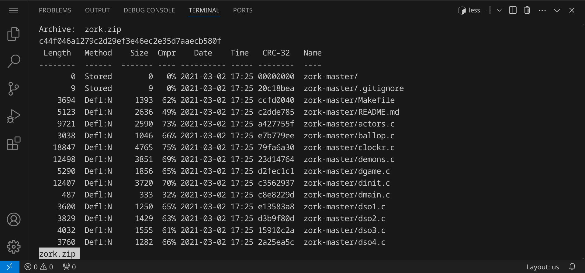

Um die einzelnen, tatsächlichen Bytes zu sehen, die in einer Datei gespeichert sind, kannst du den Befehl `hd` verwenden. Gib `hd alice.txt | less` ein und drücke die Eingabetaste. Der Befehl `hd` steht für »hexdump« und zeigt den Inhalt einer Datei in hexadezimaler Darstellung an. Du siehst die Bytes, die in der Datei gespeichert sind, und kannst so den Inhalt der Datei auf Byte-Ebene analysieren. Du kannst nun durch die Ausgabe von `hd` navigieren. Drücke die Taste <span class='key'>Q</span>, um das Programm zu beenden.

<div class='hint'>
Mit dem Zeichen <code>|</code> kann man mehrere Befehle in einer »Pipeline« miteinander verknüpfen. Die Ausgabe des ersten Befehls wird als Eingabe des zweiten Befehls verwendet. So können wir z. B. die Ausgabe von <code>hd</code> an die Eingabe von <code>less</code> weiterleiten, um die Ausgabe von <code>hd</code> seitenweise zu betrachten. Auf diese Weise lassen sich viele Befehle miteinander kombinieren.
</div>

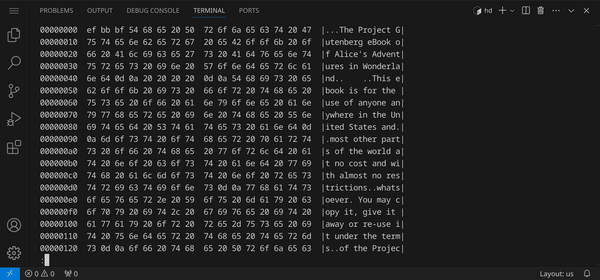

Im Hexdump siehst du immer 16 Bytes in einer Zeile. Die erste Spalte zeigt den Offset in der Datei an (hexadezimal), die zweite Spalte zeigt die hexadezimalen Werte der 16 Bytes an und die dritte Spalte zeigt die ASCII-Zeichen an, die den hexadezimalen Werten entsprechen. Wenn ein Byte nicht druckbar ist, wird ein Punkt angezeigt.

In der folgenden Tabelle siehst du, welche Werte welchem ASCII-Zeichen entsprechen:


<div class='hint'>
Ignoriere die rechte Hälfte der Tabelle &ndash; die Werte von 128 bis 255 sind nicht standardisiert und können je nach Zeichensatz unterschiedlich sein (abgebildet ist eine ASCII-Tabelle für MS-DOS von 1990). Die linke Hälfte (0 bis 127) ist jedoch standardisiert und wird von allen modernen Systemen unterstützt, wobei die Zeichen von 0 bis 31 sowie 127 nicht druckbar sind.
</div>

Wenn du dir den Hexdump genau anschaust, findest du z. B. Leerzeichen (`20`) und Zeilenumbrüche (`0d` `0a`), auch CRLF genannt. Hieran erkennst du, dass es sich um eine Windows-Textdatei handelt. Linux-Textdateien verwenden nur ein LF (`0a`) als Zeilenumbruch (trotzdem kann Linux mit beiden Arten von Textdateien umgehen).

Du kannst die Dateien natürlich auch in Visual Studio Code öffnen, indem du die linke Seitenleiste mit <span class='key'>Strg</span><span class='key'>B</span> einblendest und dann auf »Open Folder« klickst (oder einfach die Abkürzung <span class='key'>Strg</span><span class='key'>K</span>+<span class='key'>O</span> verwendest). Wähle das Verzeichnis `working-with-files` aus und klicke auf »OK«.


Links siehst du jetzt die Dateien und kannst sie (bis auf die Archivdateien) öffnen, um ihren Inhalt zu sehen.

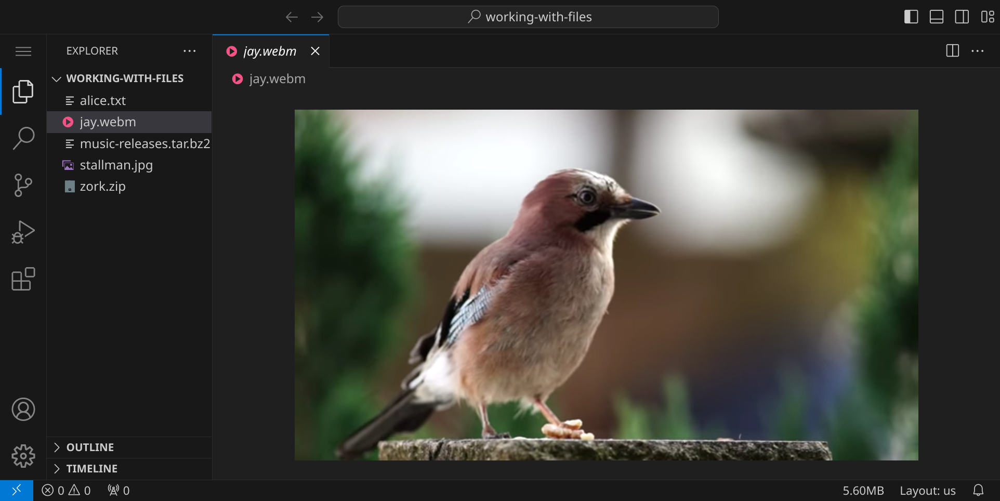

Schließe anschließend wieder alle Dateien und öffne das Terminal, um mit den nächsten Befehlen fortzufahren.

<div class='hint'>
Schließe die linke Seitenleiste und maximiere dein Terminal, um mehr Platz zu haben.
</div>

Nachdem wir uns nun einen Überblick verschafft und uns die Dateien angeschaut haben, werden wir im nächsten Abschnitt sehen, wie wir Dateien erstellen und bearbeiten können.

## Dateien erstellen und bearbeiten

<div class='hint books'>
In diesem Abschnitt lernst du die Befehle <code>touch</code>, <code>nano</code>, <code>vim</code> und <code>emacs</code> kennen.
</div>

Gib den Befehl `touch hello.txt` ein und drücke die Eingabetaste. Der Befehl `touch` erstellt eine leere Datei mit dem angegebenen Namen. Gib `ls -l` ein, um zu sehen, dass die Datei `hello.txt` erstellt wurde:

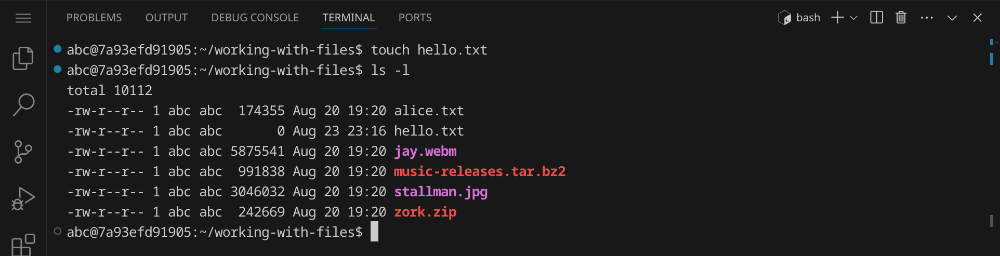

Da die Datei keinen Inhalt hat, beträgt ihre Größe erwartungsgemäß 0 Byte. Wenn du nach einer oder mehreren Minuten noch einmal `touch hello.txt` eingibst, siehst du, dass sich danach der Zeitstempel der Datei geändert hat:


Der Befehl <code>touch</code> wird oft verwendet, um den Zeitstempel einer Datei zu aktualisieren, ohne den Inhalt zu verändern. Wenn die Datei nicht existiert, wird sie erstellt.

<div class='hint'>
Um einen vorherigen Befehl zu suchen, kannst du die Pfeiltasten <span class='key'>↑</span> und <span class='key'>↓</span> verwenden und anschließend die Eingabetaste drücken, um den Befehl erneut auszuführen. So vermeidest du wiederholte Eingaben.
</div>

Es gibt verschiedene Text-Editoren für Linux, mit denen du Dateien im Terminal bearbeiten kannst. Die gebräuchlichsten Editoren sind `nano`, `vim` und `emacs`. `nano` ist der einfachste Editor und wird oft für Anfänger empfohlen. `vim` und `emacs` sind mächtige Editoren, die viele Funktionen bieten, aber auch eine steile Lernkurve haben. Wir werden uns alle drei Editoren kurz ansehen.

### Dateien bearbeiten mit `nano`

Gib den Befehl `nano hello-nano.txt` ein, um eine neue Datei zu öffnen. Du kannst nun Text eingeben und relativ intuitiv im Text navigieren. Wenn du fertig bist, speichere deinen Text mit <span class='key'>Strg</span><span class='key'>O</span> (für »write out«) und bestätige mit der Eingabetaste. Beende `nano` mit <span class='key'>Strg</span><span class='key'>X</span> (für »exit«).


### Dateien bearbeiten mit `vim`

Gib den Befehl `vim hello-vim.txt` ein, um eine neue Datei zu öffnen. `vim` hat verschiedene Modi, die du mit der Taste <span class='key'>Esc</span> wechseln kannst. Im Befehlsmodus kannst du Befehle eingeben, um Text zu bearbeiten. Im Einfügemodus kannst du Text eingeben. Um in den Einfügemodus zu wechseln, drücke <span class='key'>i</span> (für »insert«). Um den Eingabemodus zu verlassen und zum Befehlsmodus zurückzukehren, drücke <span class='key'>Esc</span>. Um `vim` zu beenden, wechsle in den Befehlsmodus und gib `:q` ein. Wenn du deine Änderungen speichern möchtest, gib `:w` ein. Wenn du `vim` beenden und deine Änderungen speichern möchtest, gib `:wq` ein.

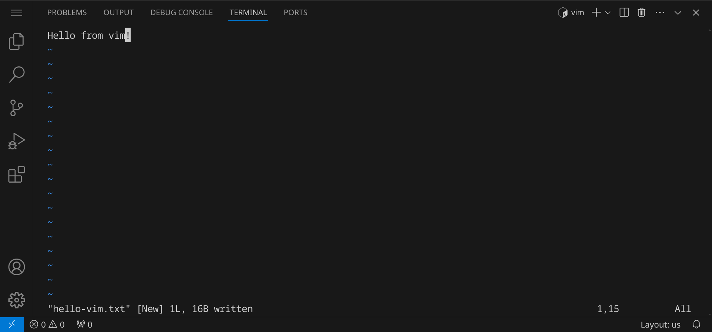

Für die oben stehende Eingabe musst du also folgende Tasten drücken:

1. <span class='key'>i</span> (für »insert«)
2. »Hello from vim« eingeben
3. <span class='key'>Esc</span> (um in den Befehlsmodus zu wechseln)
4. <span class='key'>:</span>, <span class='key'>w</span> und <span class='key'>Enter</span>, um die Datei zu speichern
5. <span class='key'>:</span>, <span class='key'>q</span> und <span class='key'>Enter</span>, um `vim` zu beenden

Falls du mehr über `vim` lernen und den Umgang mit diesem Editor trainieren möchtest, kannst du den Befehl `vimtutor` im Terminal eingeben, um ein interaktives Tutorial zu starten, für das du ca. 30 Minuten einplanen solltest:

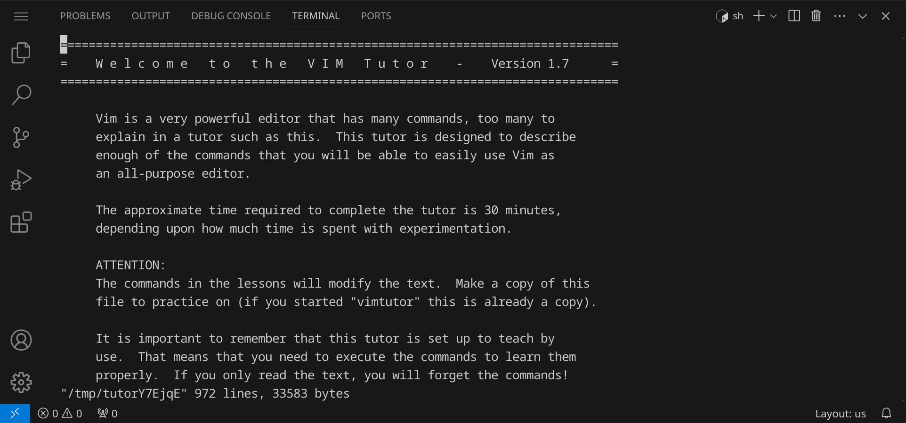

<div class='hint'>
<code>vimtutor</code> lässt sich, genau wie <code>vim</code> selbst, mit <span class='key'>:</span>, <span class='key'>q</span> und <span class='key'>Enter</span> beenden.
</div>

### Dateien bearbeiten mit `emacs`

Gib den Befehl `emacs hello-emacs.txt` ein, um eine neue Datei zu öffnen. Im Gegensatz zu `vim` kannst du hier einfach anfangen, Text einzugeben. Wenn du fertig bist, speichere deine Änderungen mit <span class='key'>Strg</span><span class='key'>X</span> und dann <span class='key'>Strg</span><span class='key'>S</span> (für »save«). Um `emacs` zu beenden, drücke <span class='key'>Strg</span><span class='key'>X</span> und dann <span class='key'>Strg</span><span class='key'>C</span>.


## Dateien analysieren, durchsuchen und filtern

<div class='hint books'>
In diesem Abschnitt lernst du die Befehle <code>wc</code>, <code>grep</code>, <code>sort</code>, <code>uniq</code>, <code>head</code> und <code>tail</code> kennen.
</div>

Gib den Befehl `wc alice.txt` ein und drücke die Eingabetaste. Der Befehl `wc` steht für »word count« und zeigt dir die Anzahl der Zeilen, Wörter und Bytes in einer Datei an:

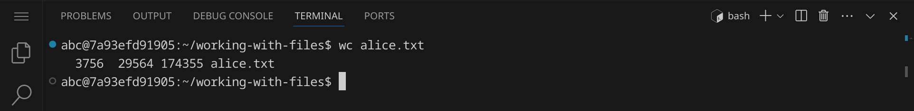

Die Datei `alice.txt` enthält also 3.756 Zeilen, 29.564 Wörter und 174.355 Bytes. Oft wird `wc` dazu verwendet, um die Anzahl der Zeilen in einer Datei zu zählen. Wenn du nur die Anzahl der Zeilen wissen möchtest, kannst du den Befehl `wc -l alice.txt` (`-l` für »lines«) verwenden:


Verwende `grep`, um nach einem bestimmten Muster in einer Datei zu suchen. Gib `grep everybody alice.txt` ein und drücke die Eingabetaste. Der Befehl `grep` sucht nach dem Muster »everybody« in der Datei `alice.txt` und zeigt die Zeilen an, in denen das Muster gefunden wurde:

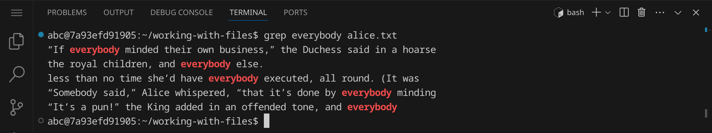

Mit der Option `-i` können wir `grep` anweisen, die Groß- und Kleinschreibung zu ignorieren. Gib `grep -i everybody alice.txt` ein und drücke die Eingabetaste:

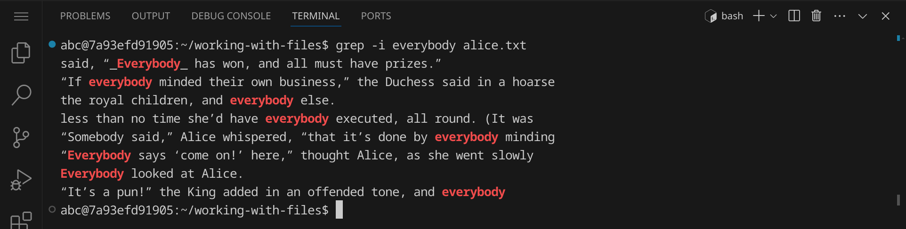

Wir haben nun ein paar weitere Stellen gefunden. Wenn du die Zeilennummer sehen möchtest, in denen das Muster gefunden wurde, kannst du die Option `-n` verwenden:


`grep` ist ein sehr mächtiges Programm mit einer Vielzahl von Optionen. Du kannst z. B. reguläre Ausdrücke verwenden, um nach komplexeren Mustern zu suchen. Gib `man grep` ein, um die manpage von `grep` zu lesen und mehr über die verschiedenen Optionen zu erfahren.

Wir wollen nun alle Wörter aus der Datei `alice.txt` extrahieren. Gib dazu den folgenden Befehl ein:

```bash
grep -o -E "[A-Za-z]+" alice.txt
```
Der reguläre Ausdruck `[A-Za-z]+` sucht nach Wörtern, die aus Groß- und Kleinbuchstaben bestehen. Du siehst, wie der gesamte Text Wort für Wort ausgegeben wird:


<div class='hint'>
Um eine lange Ausgabe seitenweise zu betrachten, kannst du an jeden Befehl einfach <code>| less</code> anhängen.
</div>

Nutze `sort`, um die Ausgabe zu sortieren:

```bash
grep -o -E "[A-Za-z]+" alice.txt | sort
```
Jetzt sind die Wörter alphabetisch sortiert:


Um Duplikate zu entfernen, können wir `uniq` verwenden:

```bash
grep -o -E "[A-Za-z]+" alice.txt | sort | uniq
```

Dadurch wurden aufeinanderfolgende Duplikate entfernt und wir sehen nun eine alphabetisch sortierte Liste aller Wörter, die im Text vorkommen:


Allerdings gibt es hinsichtlich der Groß- und Kleinschreibung noch Duplikate. Um auch diese zu entfernen, können wir die Option `-i` von `uniq` verwenden:

```bash
grep -o -E "[A-Za-z]+" alice.txt | sort | uniq -i
```
Nun ist unsere Liste fertig:

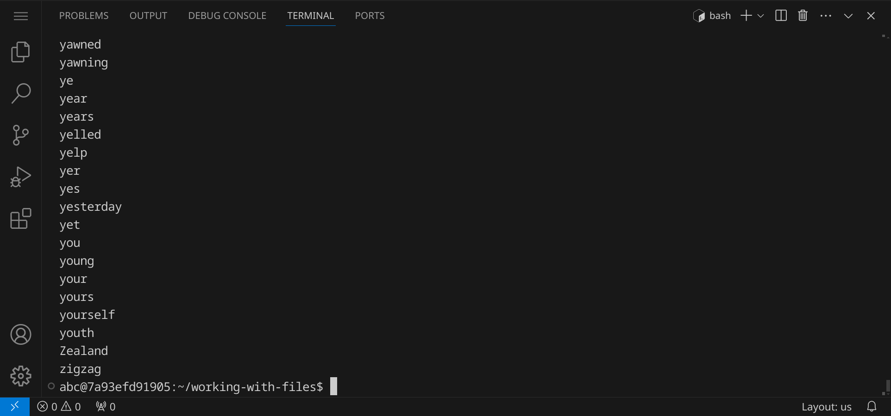

Wir können nun die Anzahl der Wörter in der Liste zählen:

```bash
grep -o -E "[A-Za-z]+" alice.txt | sort | uniq -i | wc -l
```
Die Ausgabe zeigt, dass es 3.002 verschiedene Wörter in der Datei `alice.txt` gibt.

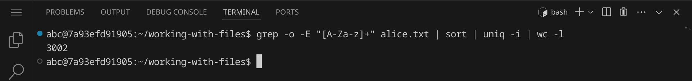

Wir können unser Ergebnis auch in einer Datei speichern, indem wir die Ausgabe der gesamten Pipeline in eine Datei umleiten:

```bash
grep -o -E "[A-Za-z]+" alice.txt | sort | uniq -i > words.txt
```
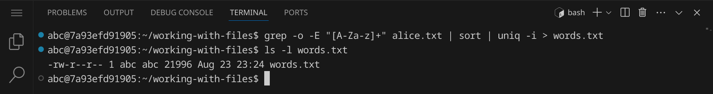

Es gibt noch zwei weitere Befehle, die nützlich sind, wenn man nur den Anfang oder das Ende einer Datei oder einer Ausgabe sehen möchte. Nutze `head`, um die ersten 10 Zeilen einer Datei oder einer Ausgabe zu sehen:

```bash
head words.txt
```


Analog dazu kannst du `tail` verwenden, um die letzten 10 Zeilen einer Datei oder einer Ausgabe zu sehen:

```bash
tail words.txt
```
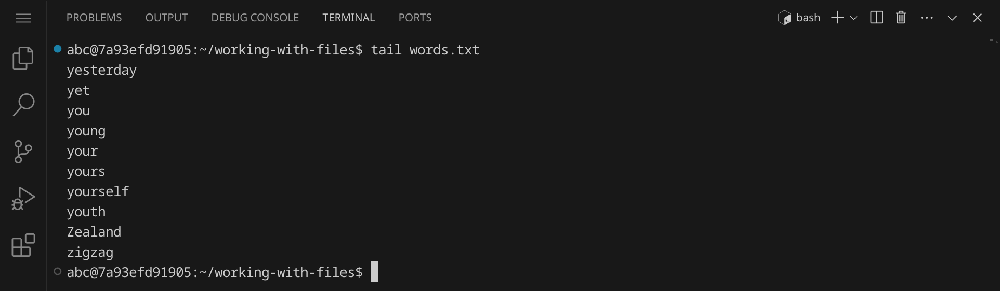

`tail` wird in Verbindung mit der Option `-f` (für »follow«) oft verwendet, um eine Datei in Echtzeit zu beobachten. Wenn du z. B. eine Logdatei überwachen möchtest, kannst du `tail -f logfile.log` verwenden, um die letzten Zeilen der Datei anzuzeigen und neue Zeilen anzuzeigen, sobald sie hinzugefügt werden.

## Dateien archivieren und extrahieren

<div class='hint books'>
In diesem Abschnitt lernst du die Befehle <code>tree</code>, <code>unzip</code>, <code>tar</code>, <code>gzip</code> und <code>bzip2</code> kennen.
</div>

## Verzeichnisse analysieren und durchsuchen

<div class='hint books'>
In diesem Abschnitt lernst du die Befehle <code>du</code> und <code>find</code> kennen.
</div>

## Dateien (und Verzeichnisse) kopieren, verschieben und löschen

<div class='hint books'>
In diesem Abschnitt lernst du die Befehle <code>rm</code>, <code>cp</code>, <code>mv</code>, <code>mkdir</code> und <code>rmdir</code> kennen.
</div>

## Dateien aus dem Internet herunterladen

<div class='hint books'>
In diesem Abschnitt lernst du die Befehle <code>wget</code> und <code>curl</code> kennen.
</div>
