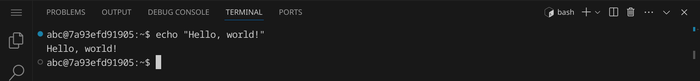

# Dateien und Verzeichnisse

<p class='abstract'>
In diesem Kapitel lernst du, wie du mit Dateien und Verzeichnissen in der Kommandozeile arbeiten kannst. Wir werden einige der wichtigsten Befehle kennenlernen, die wir verwenden können, um Dateien und Verzeichnisse zu erstellen, zu löschen, zu kopieren, zu verschieben und zu bearbeiten. Wir werden auch lernen, wie wir den Inhalt von Dateien anzeigen und analysieren können.
</p>

Stelle zuerst sicher, dass du keinen Ordner geöffnet hast. Um sicherzugehen, drücke einfach den Shortcut für »Ordner schließen«: <span class='key'>Strg</span><span class='key'>K</span> und dann <span class='key'>F</span>. Dein Workspace sollte jetzt ungefähr so aussehen:


Öffne als nächstes das Terminal, indem du den Shortcut <span class='key'>Strg</span><span class='key'>J</span> drückst. Dein Workspace sollte jetzt ungefähr so aussehen:


Du kannst das Terminal auch maximieren, indem du auf den Pfeil in der rechten oberen Ecke des Terminals klickst. Die linke Seitenleiste kannst du mit <span class='key'>Strg</span><span class='key'>B</span> ein- und ausblenden.

Im Terminal siehst du nun einen Prompt, der dir anzeigt, in welchem Verzeichnis du dich befindest. Der Prompt sieht in etwa so aus:

```bash
abc@fefd40576dad:~$
```

Lass dich von dem Prompt nicht verwirren. Der Teil `abc` vor dem `@` ist dein Benutzername, der Teil `fefd40576dad` nach dem `@` ist der Name deines Computers, und der Teil nach dem `:` ist das aktuelle Verzeichnis. In diesem Fall ist das aktuelle Verzeichnis `~`, was das Home-Verzeichnis deines Benutzers ist. Das `$` am Ende des Prompts zeigt an, dass du als normaler Benutzer angemeldet bist. Wenn du als Administrator angemeldet wärst, würde das `$` durch ein `#` ersetzt.

Gib folgenden Befehl ein und drücke die Eingabetaste:

```bash
echo "Hello, World!"
```
Wenn du die Ausgabe `Hello, World!` siehst, hast du alles richtig gemacht. Herzlichen Glückwunsch!



Jetzt können wir anfangen, mit Dateien und Verzeichnissen zu arbeiten.

## Beispieldateien herunterladen

Gib folgenden Befehl ein, um eine Datei herunterzuladen, die ein paar Beispieldateien enthält:

```bash
wget #{WEB_ROOT}/dl/working-with-files.tar.gz
```
Die Ausgabe sollte in etwa so aussehen:


Das Programm `wget` können wir dazu verwenden, um Dateien aus dem Internet herunterzuladen.
Die Datei wird standardmäßig im aktuellen Verzeichnis gespeichert. Schau nach, ob die Datei
angekommen ist, indem du den Befehl `ls` eingibst:


Für mehr Details verwende den Befehlt `ls -l`:


Du siehst nun, wie groß die Datei ist. Nutze den Befehl `ls -lh`, um die Größe in einer
menschlich lesbaren Form zu sehen:


Die Datei ist also fast 10 MB groß. Die Endung `.tar.gz` zeigt an, dass es sich um ein
komprimiertes Archiv handelt. Wir können es mit dem Befehl `tar` entpacken:

```bash
tar xvf working-with-files.tar.gz
```

Die Optionen `xvf` stehen für `extract`, `verbose` und `file`. Das bedeutet, dass wir das
Archiv entpacken (`x` für »extract«), den Fortschritt anzeigen (`v` für »verbose«) und als
nächste Option den Dateinamen angeben (`f` für »file«). Wenn du den Befehl
ausführst, solltest du eine Meldung sehen, die dir anzeigt, welche Dateien entpackt wurden:


<div class='hint'>
Um dein Terminal aufzuräumen, kannst du den Befehl <code>clear</code> verwenden oder einfach die Tastenkombination <span class='key'>Strg</span><span class='key'>L</span> drücken.
</div>

## Überblick verschaffen

<div class='hint'>
In diesem Abschnitt lernst du die Befehle <code>pwd</code>, <code>cd</code>, <code>tree</code>, <code>file</code> und <code>ls</code> kennen.
</div>

- `pwd`: Zeigt das aktuelle Verzeichnis an.
- `cd`: Wechselt das aktuelle Verzeichnis.
- `tree`: Zeigt die Verzeichnisstruktur an.
- `file`: Zeigt den Dateityp einer Datei an.
- `ls`: Listet Dateien und Verzeichnisse auf.

## Dateien anzeigen

<div class='hint'>
In diesem Abschnitt lernst du die Befehle <code>cat</code>, <code>less</code> und <code>hd</code> kennen.
</div>

- `cat`: Zeigt den Inhalt einer Datei an.
- `less`: Zeigt den Inhalt einer Datei seitenweise an.
- `hd`: Zeigt den hexadezimalen Inhalt einer Datei an.

## Dateien erstellen und bearbeiten

<div class='hint'>
In diesem Abschnitt lernst du die Befehle <code>touch</code>, <code>nano</code>, <code>vim</code> und <code>emacs</code> kennen.
</div>

- `touch`: Erstellt eine leere Datei.
- `nano`, `vim`, `emacs`: Bearbeitet eine Datei.

## Dateien analysieren, durchsuchen und filtern

<div class='hint'>
In diesem Abschnitt lernst du die Befehle <code>wc</code>, <code>grep</code>, <code>sort</code>, <code>uniq</code>, <code>head</code>, <code>tail</code>, <code>diff</code> und <code>sha1sum</code> kennen.
</div>

- `wc`: Zählt die Anzahl der Zeilen, Wörter und Zeichen in einer Datei.
- `grep`: Sucht nach einem Muster in einer Datei.
- `sort`: Sortiert die Zeilen einer Datei.
- `uniq`: Entfernt doppelte Zeilen aus einer Datei.
- `head`: Zeigt die ersten Zeilen einer Datei an.
- `tail`: Zeigt die letzten Zeilen einer Datei an.
- `diff`: Zeigt den Unterschied zwischen zwei Dateien an.
- `sha1sum`: Berechnet den SHA-1-Hashwert einer Datei.
- Umleiten von stdout

## Verzeichnisse analysieren und durchsuchen

<div class='hint'>
In diesem Abschnitt lernst du die Befehle <code>du</code> und <code>find</code> kennen.
</div>

- `du`: Zeigt die Größe von Dateien und Verzeichnissen an.
- `find`: Sucht nach Dateien und Verzeichnissen.

## Dateien (und Verzeichnisse) kopieren, verschieben und löschen

<div class='hint'>
In diesem Abschnitt lernst du die Befehle <code>rm</code>, <code>cp</code>, <code>mv</code>, <code>mkdir</code> und <code>rmdir</code> kennen.
</div>

- `rm`: Löscht eine Datei.
- `cp`: Kopiert eine Datei oder ein Verzeichnis.
- `mv`: Verschiebt eine Datei oder ein Verzeichnis.
- `mkdir`: Erstellt ein neues Verzeichnis.
- `rmdir`: Löscht ein Verzeichnis.

## Dateien archivieren und extrahieren

<div class='hint'>
In diesem Abschnitt lernst du die Befehle <code>tar</code>, <code>gzip</code>, <code>bzip2</code>, <code>zip</code> und <code>unzip</code> kennen.
</div>

- `tar`: Archiviert und extrahiert Dateien.
- `gzip` und `bzip2`: Komprimiert und dekomprimiert Dateien.
- `zip` und `unzip`: Komprimiert und dekomprimiert Dateien.

## Dateien aus dem Internet herunterladen

<div class='hint'>
In diesem Abschnitt lernst du die Befehle <code>wget</code> und <code>curl</code> kennen.
</div>

- `wget`: Lädt Dateien aus dem Internet herunter.
- `curl`: Lädt Dateien aus dem Internet herunter.
